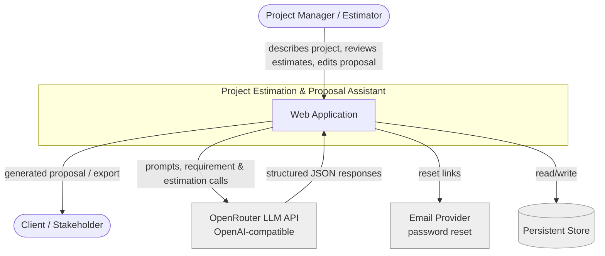
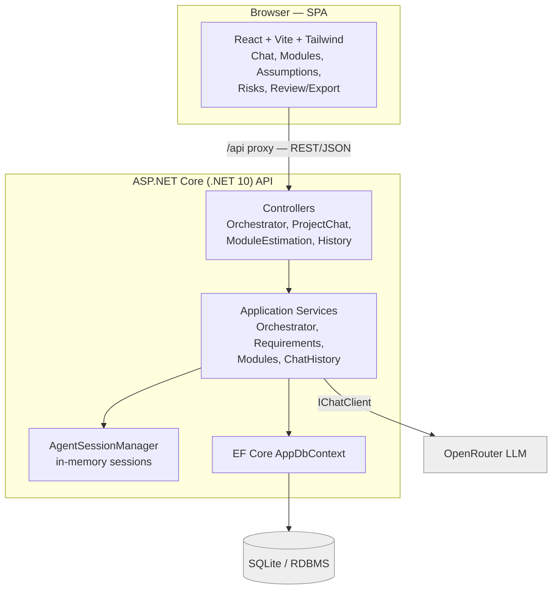
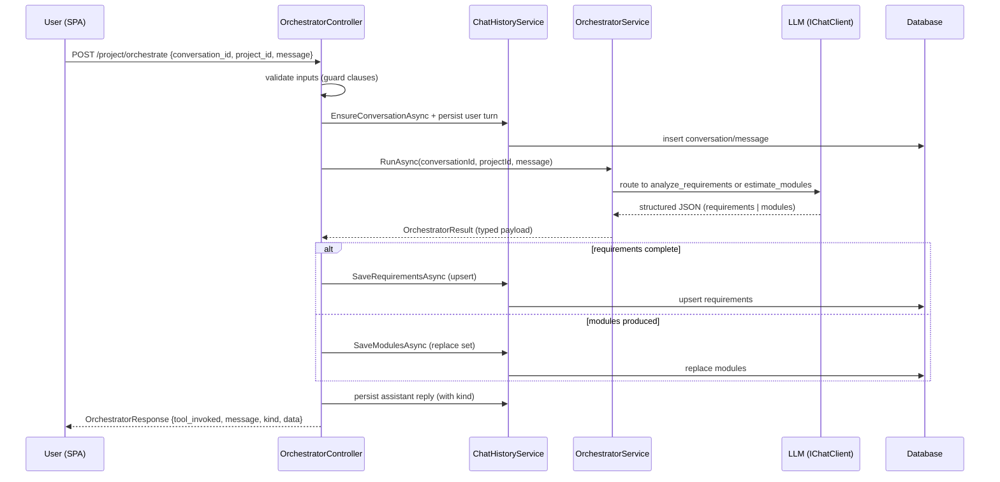
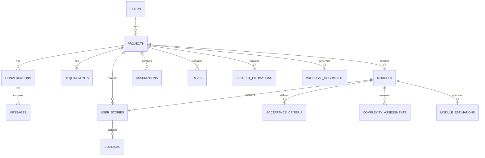
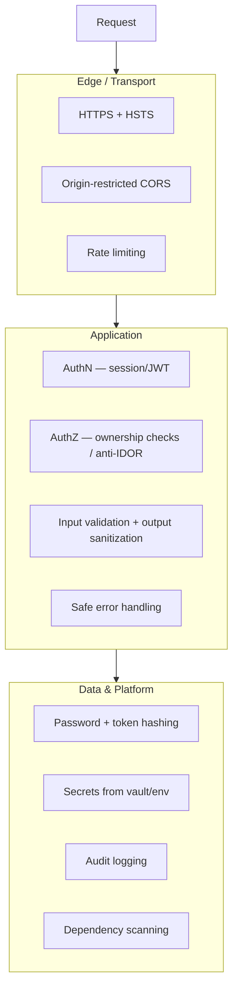
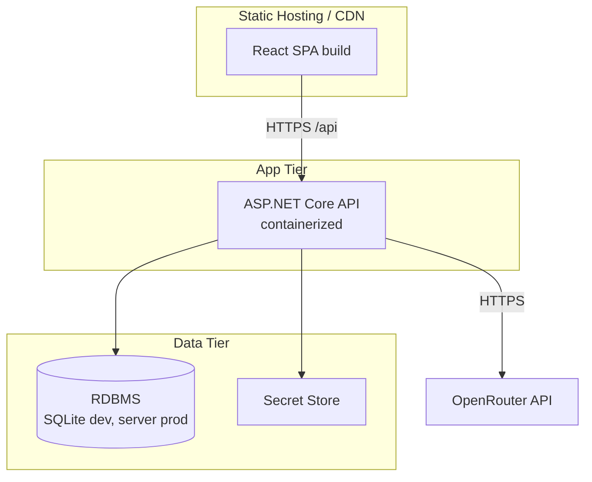

# High-Level Design — Project Estimation & Proposal Assistant

**Version:** 1.0  ·  **Date:** 2026-07-16  ·  **Status:** Draft

## 1. Purpose & Scope

The Project Estimation & Proposal Assistant is an AI-powered platform that turns a
conversational description of a software project into a structured estimate and a
client-ready proposal. A user describes their project in chat; a pipeline of AI agents
gathers requirements, decomposes the project into modules, generates user stories and
subtasks, assesses complexity, rolls up effort into a total estimate with a risk buffer,
and finally compiles a proposal document.

This document describes the system at the architectural level: contexts, containers,
components, key flows, and cross-cutting concerns (security per OWASP Top 10, observability,
deployment). Detailed class/sequence design is in `LLD_document.md`.

## 2. Architecture Principles

- **Thin controllers, service-driven logic.** Controllers validate and delegate; services own agent orchestration and persistence.
- **Server-authoritative state.** Persistence decisions (isMatched, totals) are derived server-side, never trusted from the client.
- **Model output is data, never code.** LLM responses are parsed, validated, and rendered/persisted — never executed.
- **Stateless HTTP, session-scoped AI context.** Conversation continuity is keyed by `conversationId`; agent sessions live in an in-memory manager.
- **Security by default (OWASP-aligned).** AuthN/AuthZ, input validation, secrets management, and safe error handling are first-class.

## 3. System Context (C4 Level 1)

## 4. Container View (C4 Level 2)

**Notes**
- The Vite dev server proxies `/api/*` to the backend (`localhost:5118`), rewriting the prefix.
- `IChatClient` is a singleton wrapping the OpenRouter (OpenAI-compatible) endpoint.
- SQLite is used today (`EnsureCreated` on startup); the schema is portable to a server RDBMS for production.

## 5. Component View — Backend

```mermaid
graph LR
    subgraph Controllers
        OC[OrchestratorController<br/>POST /project/orchestrate]
        PC[ProjectChat<br/>POST /project/chat]
        ME[ModuleEstimationAgent<br/>POST /project/modules]
        HC[HistoryController<br/>GET /project/&#123;id&#125;/history<br/>GET /project/&#123;id&#125;]
    end

    subgraph Services
        OS[OrchestratorService]
        RS[RequirementsService]
        MS[ModulesService]
        CHS[ChatHistoryService]
    end

    ASM[AgentSessionManager]
    DBX[AppDbContext]

    OC --> OS
    OC --> CHS
    PC --> RS
    PC --> CHS
    ME --> MS
    ME --> CHS
    HC --> CHS

    OS --> RS
    OS --> MS
    OS --> CHS
    OS --> ASM
    RS --> ASM
    MS --> ASM
    CHS --> DBX
```

## 6. Estimation Pipeline (Product Flow)

The frontend surfaces an eight-stage pipeline. Stages 1–2 are built; 3–8 are the target roadmap
backed by the target ER model.

```mermaid
flowchart LR
    A[1. Requirements] --> B[2. Modules]
    B --> C[3. Assumptions]
    C --> D[4. Risks]
    D --> E[5. User Stories]
    E --> F[6. Effort Estimation<br/>subtasks + complexity]
    F --> G[7. Total Project Estimation<br/>+ risk buffer + confidence]
    G --> H[8. Proposal Generation]

    style A fill:#d4edda,stroke:#28a745
    style B fill:#d4edda,stroke:#28a745
    style C fill:#fff3cd,stroke:#ffc107
    style D fill:#fff3cd,stroke:#ffc107
    style E fill:#f8d7da,stroke:#dc3545
    style F fill:#f8d7da,stroke:#dc3545
    style G fill:#f8d7da,stroke:#dc3545
    style H fill:#fff3cd,stroke:#ffc107
```

Legend: green = built · amber = partial (UI only) · red = planned.

## 7. Orchestration Flow (Runtime)

## 8. Data Architecture (Target, Conceptual)

The current persisted model covers Conversations, Messages, Requirements, and Modules.
The target model (from `docs/erDiagram.txt`) extends this to the full estimation domain.

Full attribute-level ER and the gap between current and target are in `LLD_document.md`.

## 9. Cross-Cutting: Security (OWASP Top 10 2021)

| OWASP category | Control in this system |
|---|---|
| A01 Broken Access Control | Every project/conversation/module endpoint verifies the resource belongs to the authenticated user (anti-IDOR); no wildcard reads. |
| A02 Cryptographic Failures | Passwords hashed with bcrypt/Argon2 + salt; reset tokens hashed; TLS in transit; secrets never in code. |
| A03 Injection | Parameterized EF queries; DTO validation; model output rendered as data (no HTML/script execution, no `javascript:` links). |
| A04 Insecure Design | Server-authoritative routing/totals; rate-limited LLM endpoints to bound cost and DoS. |
| A05 Security Misconfiguration | Environment-scoped CORS (no wildcard-with-credentials); HSTS; no debug details in responses. |
| A06 Vulnerable Components | Pinned dependencies; `dotnet list package --vulnerable` / `npm audit` in CI. |
| A07 Identification & Auth Failures | Strong password policy; brute-force throttling; single-use expiring reset tokens; server-side logout. |
| A08 Software & Data Integrity | Upserts keyed by conversation; server recomputes estimates; proposals generated from stored data. |
| A09 Logging & Monitoring | Structured audit logs for auth, access denials, and generation events; no secrets/PII in logs. |
| A10 SSRF | Outbound calls restricted to the configured LLM endpoint; uploaded document content cannot trigger arbitrary fetches. |

**Known gaps to remediate (see US-039..US-046):** hardcoded LLM key fallback in `Program.cs`, unauthenticated endpoints, and `ex.Message` returned to clients.

## 10. Deployment View

## 11. Technology Stack

| Layer | Technology |
|---|---|
| Frontend | React, Vite, Tailwind CSS, React Router, TipTap editor, lucide-react |
| Backend | ASP.NET Core (.NET 10), controller-based Web API |
| AI | Microsoft.Extensions.AI (`IChatClient`), Microsoft.Agents.AI (`AIAgent`, sessions), OpenRouter provider |
| Data | EF Core, SQLite (dev), JSON value converters for list columns |
| Testing | xUnit, `WebApplicationFactory` integration tests, `FakeChatClient` |

## 12. Quality Attributes

- **Performance:** conversational turns should return within an interactive latency budget; long pipelines run asynchronously with progress feedback.
- **Scalability:** stateless API tier scales horizontally; the in-memory `AgentSessionManager` must move to a distributed store (e.g., Redis) for multi-instance deployments.
- **Reliability:** agent JSON parsing failures degrade gracefully to an error envelope rather than crashing the turn.
- **Security:** as per Section 9.
- **Accessibility:** WCAG 2.1 AA targeted; full validation requires manual assistive-technology testing and expert review.
